# Como rodar queries e mutations utilizando o Apollo Playground

<br /><br />
O objetivo desse tutorial é ser um breve <i>'quick start'</i> sobre `Como rodar queries e mutations utilizando o Apollo Playground`, para ter maior entendimento sobre GraphQL recomendo estudar com calma a 
<a href="https://graphql.org/learn/">documentação oficial</a>.<br />
Bom, supondo que você tenha pouca ou nenhuma familiaridade com o Graphql, vamos começar do início.

<br />
Primeiramente, instale no seu projeto os pacotes necessários:

```
graphql
apollo-server
apollo-server-core
``` 

O pacote apollo-server-core será útil aqui para utilizarmos o plugin `ApolloServerPluginLandingPageGraphQLPlayground`

Importe os pacotes no seu projeto

```
import { gql, ApolloServer } from "apollo-server";
import { ApolloServerPluginLandingPageGraphQLPlayground as Playground } from "apollo-server-core";
```

<h1></h1>

<h2>typeDefs</h2>
<h3>O que são typeDefs ?</h3>
Basicamente, typeDefs é a definição do schema "tipos" que existirão nas respostas de sua API. <br />
Veja mais sobre os schemas graphql <a href="https://graphql.org/learn/schema/">Aqui</a>

<br />
<h2>Declarando typeDefs</h2>

```js
const typeDefs = gql`

  type Query {
    hello: String!
  }
`;
```

O Código acima 'diz' que na sua API GraphQL existe um `endpoint` do tipo `Query` ( consulta ), de nome `hello` que `obrigatoriamente` retorna uma `string`. Uma curiosidade sobre a notação gql: Trata-se de um `Tagged template`. Você poderá entender melhor <a href="https://developer.mozilla.org/pt-BR/docs/Web/JavaScript/Reference/Template_literals">Aqui</a>

<h1></h1>

<h2>resolvers</h2>
<h3>O que são resolvers ?</h3>
Simplificadamente, os resolvers "resolvem" suas chamadas da API. É no objeto resolvers que você irá declarar as funções que retornarão os dados solicitados.

<br />
<h2>Declarando resolvers</h2>

```js
const resolvers = {
  Query: {
    hello: () => "Olá futuro sênior !"
  }
};
```

O Código acima descreve que dentro das chamadas do tipo `Query` temos um resolver de nome `hello` que irá retornar uma `string` "Olá futuro sênior !"

<h1></h1>

<h2>ApolloServer</h2>
<h3>Vamos ver a mágica acontecer</h3>

<br />
<h2>Instânciando um servidor</h2>

```js
const server = new ApolloServer({ typeDefs, resolvers, plugins: [Playground()] });
server.listen();
```

O código acima declara uma nova instância do ApolloServer, e passamos como parâmetros os nossos objetos `typeDefs` e `resolvers`. Neste exemplo estamos utilizando o plugin `GraphQLPlayground` mas o mesmo `não é necessário` para rodar o servidor. ( teste sem o plugin )

<br />

Agora, rodamos o nosso servidor usando npm start (configure o script de inicialização).<br />
Recomendo usar o `nodemon` para atualizar sempre que houver alguma modificação no código.<br />
Abra seu navegador e acesse `localhost:4000` e lá estará seu novo ambiente de diversão e alegria.<br >
O ApolloServer usa a porta 4000 por padrão. Você pode usar outra porta passando como parâmetro no objeto `listen`

<br />

```js
server.listen(5000).then(({ url }) => console.log("server is running at " + url)); // http://localhost:5000/
```

<h1></h1>

<h2>Fazendo sua primeira consulta</h2>

No lado esquerdo do Apollo Playground, temos o campo onde escreverá suas querys ou `mutations` <br /> ( aprenderás o que é uma `mutation` logo em breve )<br /><br />

Vamos testar a nossa Query `hello`
<br />
Execute a Query clicando no botão central ( play ) e observe o resultado no painel ao lado direito:

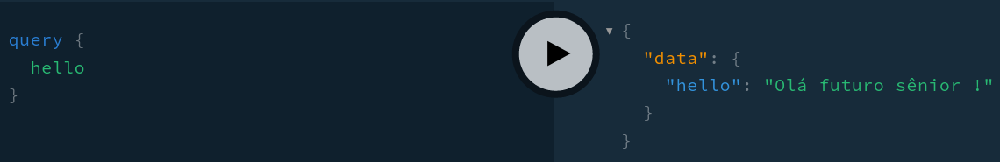

<br />
Agora aproveite que está no Playground e brinque um pouco. Faça alguns testes, como por exemplo: <br />

Modifique seu tipo definido da Query `hello` para `Boolean!` ao invés de `String!` <br />
Rode a consulta e veja o que acontece.

<h1></h1>

<h2>O poder do GraphQL</h2>

GraphQL é uma `linguagem de consulta` cuja prioridade é fornecer exatamente os dados que os clientes solicitam e nada além, resolvendo assim muitos problemas como busca excessiva (overfetching) / insuficiente (underfetching) e consequêntemente problemas de performance e consumo de banda.

<br />
<h3>Vamos ver isso na prática</h3>
Suponha que temos uma lista de usuários no nosso sistema:

```js
const users = [
  {
    id: 0,
    name: "Devinho",
    age: 18,
    email: "devinho@bug.com",
    isDeveloper: true
  },
  {
    id: 1,
    name: "Juninho",
    age: 20,
    email: "juninho@dev.com",
    isDeveloper: true
  },
  {
    id: 2,
    name: "Fulaninho",
    age: 99,
    email: "fulano@old.com",
    isDeveloper: false
  },
]
```

Como faríamos uma consulta que retorne somente o nome dos usuários ? <br />
Primeiramente, vamos definir nossos tipos no template typeDefs ( lembra ) ?

```js
const typeDefs = gql`

  type User {

    id: ID!,
    name: String!,
    age: Int!,
    email: String,
    isDeveloper: Boolean!,
  }

  type Query {
    listDevelopers: [User!]!
  }

`;
```
Declaramos o tipo User, que possui as propriedades: name, age, email e isDeveloper. <br />
Para entender mais a fundo os <i>tipos escalares</i> do graphql, clique <a href="https://graphql.org/learn/schema/">Aqui</a><br /><br />

Mas basicamente o que fizemos foi:<br />
Declaramos um novo tipo `User` que possui todos os campos obrigatórios 👉 `!`<br />
Declaramos uma nova Query `listDevelopers` que retorna um array de `Users` obrigatoriamente. <br />

<br />Agora vamos configurar o `resolver` dessa Query:

```js
const resolvers = {

  Query: {
    listDevelopers: () => users
    // ... outras querys
  },
};
```

O que fizemos foi: temos um `resolver listDevelopers` que retorna `users` ( nossa lista de usuários acima )

Agora vamos fazer nossa consulta, e retornar apenas os campos que queremos ( name ):

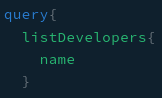

Resultado:

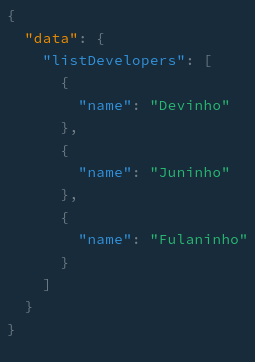

Agora se precisarmos de mais informações, basta adicionar na nossa query:

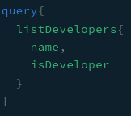

Resultado:

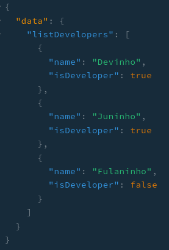

E esse comportamento pode ser aplicado 'encadeando' informações, como por exemplo: <br />
Supondo que agora temos outra lista, com as tecnologias que cada desenvolvedor curte:

Vamos declarar o tipo: ( `typeDefs` )

```graphql
  type Stack {
    name: String!
    score: Float!
  }
```

Já temos a lista:

```js
const stackList = [
  { name: "Typescript", score: 1.1 },
  { name: "NodeJs", score: 1.2 },
  { name: "PostgreSQL", score: 1.5 },
  { name: "Prisma", score: 1.3 },
  { name: "React", score: 0.9 },
  { name: "GraphQL", score: 2.1 },
  // ...
];
```

Adicionamos o campo no `User`

```graphql
  type User {
    // ...
    stack: [Stack]
  }
```

E por fim, adicionamos a nossa lista nas propriedades dos nossos usuários:

```js
const devinhoStackList = stackList.slice(0, 2);

const users = [
  {
    id: 0,
    name: "Devinho",
    age: 18,
    email: "devinho@bug.com",
    isDeveloper: true,
    stack: devinhoStackList // bem aqui
  },
  // ...
];
```

Agora podemos fazer consultas e trazer os dados do nosso usuário e suas tecnologias preferidas:

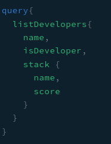

Resultado:

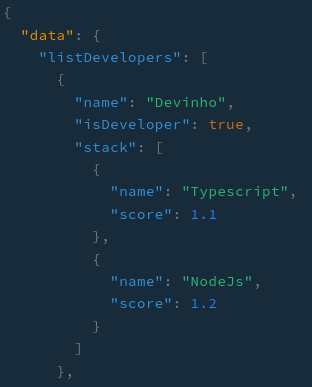

<h1></h1>

<h2>Arguments</h2>
<h3>O que são Arguments e para que serve ?</h3><br />

Arguments são parâmetros que podem ser passados numa consulta, para obter um determinado tipo de dado. Por exemplo, e se quiséssemos obter da lista de usuários somente o que possuí o id `2` ?
<br />
<br />

Em `typeDefs`, podemos definir uma nova Query que aceita um `id` como argumento: 

```graphql
  type Query {
    ...
    getDev(id: Int): User
  }
```

Já nos resolvers, recebemos alguns parâmetros. Neste exemplo exploraremos somente o parâmetro args, e vamos ignorar o primeiro parâmetro. Caso queira entender melhor clique <a href="https://www.apollographql.com/docs/apollo-server/data/resolvers/#handling-arguments">Aqui</a>

```js
const resolvers = {
  Query: {
    // ... resolvers anteriores
    getDev: (_, args) => users[args.id], // podemos fazer destructuring aqui
    // ou seja: 
    getDev: (_, { id }) => users[id]
  },
};
```

E claro, poderíamos delegar essa responsabilidade de buscar o usuário para outra entidade, como por exemplo:

```js
"./services/users.ts"
const findUser = async (id: number) => await users.find((user) => user.id === id);

"./graphql/resolvers.ts"
const resolvers = {
    getDev: async (_, { id }) => await findUser(id) // exemplo assíncrono
  }
};
```

<h2>O parâmetro parent</h2><br />

O parâmetro parent é o primeiro parâmetro do `resolver`, e agora vamos ver um exemplo de como podemos utilizá-lo. <br />
Suponha que temos uma tabela de veículos em nosso bd:

```js
const vehicles = [
  { id: 0, model: "Opala", year: 1972 },
  { id: 1, model: "Ômega", year: 1992 },
  { id: 2, model: "Santana", year: 1994 },
  { id: 3, model: "Gol GTI", year: 1990 },
  { id: 4, model: "Maverick", year: 1970 },
];
```
E agora, como fazemos para relacionar esses veículos com os nossos usuários ?<br />
Primeiro vamos criar o tipo `Vehicle`

```js
"./graphql/typedefs.ts"
  type Vehicle {
    id: ID!
    model: String!
    year: Int!
  }
```

Depois vamos adicionar o campo no tipo `User`

```js
"./graphql/typedefs.ts"
  type User {
    ...
    vehicle: Vehicle!
  }
```

E vamos adicionar o campo `vehicle` nos nossos usuários cadastrados:

```js
const users = [
  {
    name: "Devinho",
    ...
    vehicle: 1
  },
```

Porém, se tentarmos rodar essa query obtendo os dados do veículo receberemos um erro: `Cannot return null for non-nullable fields ...` Para resolver esse problema, podemos "resolver" o `User` nos `resolvers`

```js
const resolvers = {

  User: {  // nosso tipo User
    vehicle(parent) { // propriedade que queremos resolver ( vehicle )
       console.log(parent.vehicle) // acessando a propriedade
    }
  },
  ...
}
```

Agora que podemos acessar o id do veículo, fica fácil fazer esse "relacionamento" :

```js
const resolvers = {

  User: {
    vehicle: (user: { vehicle: number }) =>  vehicles.find(vehicle => vehicle.id === user.vehicle)
  },
}
```

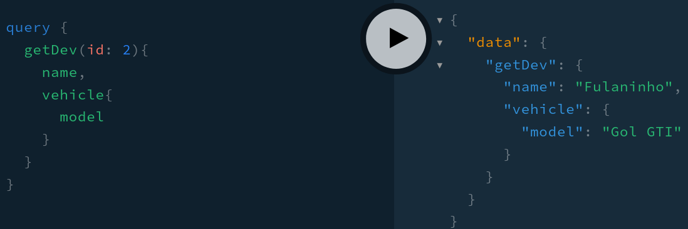

<br />

<h2>Aliases</h2><br />

Suponha que precisássemos buscar, na mesma query os dados de dois usuários: <br />

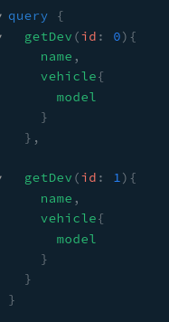

Rode a query acima e veja o que acontece:<br />
Provavelmente você recebeu o erro `Fields \"getDev\" conflict because they have differing arguments.`<br />
Como o erro descreve, existe um conflito na busca dos dados. Resolver isso é fácil utilizando Aliases:

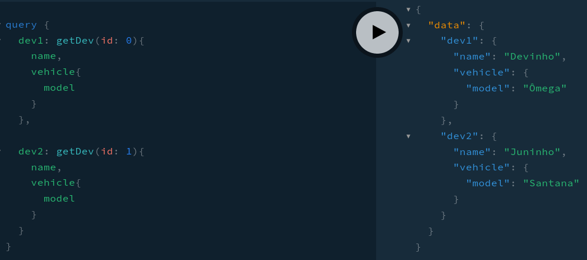

Perceba que agora estamos separando os resultados da nossa busca usando o aliase `dev1` e `dev2`

<br />

<h2>Fragments</h2><br />

Você já deve ter percebido que pode existir uma grande repetição de propriedades ao fazer muitas consultas no nosso playGround:

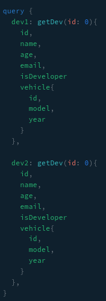

E isso pode escalar muito rápidamente se fôssemos utilizar muitos dados repetidamente. <br />
Como resolver esse problema ? Utilizando os `Fragments`

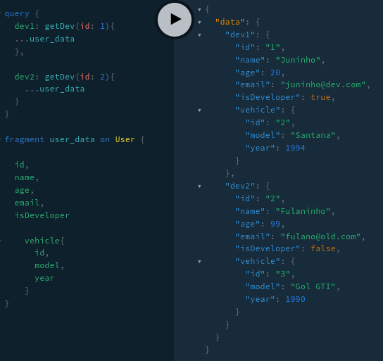

Basicamente o que fizemos foi: <br />
Criamos um "fragmento" que possui as propriedades que queremos de `User` <br />
Agora podemos utilizar um <a href="https://developer.mozilla.org/pt-BR/docs/Web/JavaScript/Reference/Operators/Spread_syntax">spread operator</a> para distribuir essas propriedades na nossa query.<br />
<br />

E com isso podemos facilmente "customizar" nossas consultas:
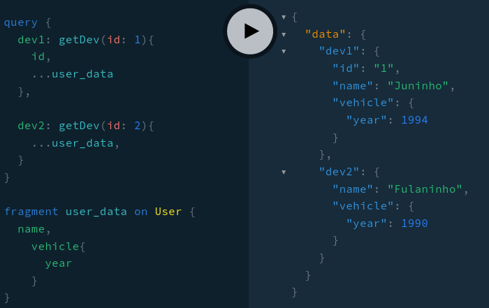<br />
Veja que buscamos o `id` do `dev1` e não buscamos o `id` do `dev2`

<br />

<h2>Enums</h2>

Você pode usar Enums para ajudar na tipagem dos dados da sua aplicação, veja mais <a href="https://graphql.org/learn/schema/#enumeration-types">aqui</a> 

Por exemplo, supondo que nossos usuários possuem o campo `profile` que é uma `string`, como poderíamos "tipar" essa string para obtermos somente valores válidos ?

```js
  "./graphql/typedefs.ts"

  enum Profiles {
    USER
    ADMIN
  }
  
  type User {
    ...
    profile: Profiles!
  }
```

```js
const users = [
  {
    id: 0,
    ...
    profile: "USER"
  },
```

Com isso nós tipamos a propriedade `profile` que só pode ser `USER` ou `ADMIN` <br />
Caso outro valor seja enviado lançará um erro na nossa query: ` "Enum \"Profiles\" cannot represent value: ... `

<br />

<h2>Variáveis</h2>

Também é possível passar variáveis para as nossas querys da seguinte forma:

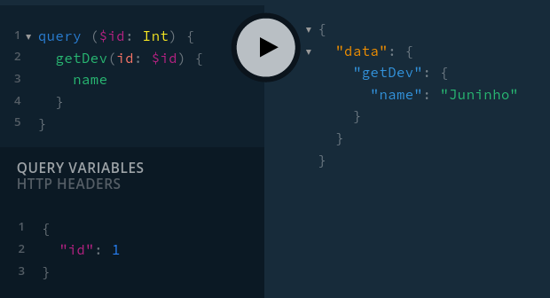<br />

Utilizando `($id: Int)` depois de `query` estamos dizendo que nossa consulta recebe uma variável como parâmetro, nesse caso `id` que possuí o tipo `Int` e é enviada no campo inferior ( `QUERY VARIABLES`)<br />
É uma `boa prática` utilizar variáveis para facilitar as consultas de sua api

<br />

<h2>Operation Name</h2>

É considerada uma `boa prática` dar nomes as nossas querys. Felizmente, isso é bem fácil:

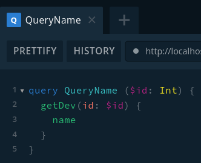<br />
Perceba que depois de `query` nós nomeamos a nossa query  para `QueryName` <br />
Com isso podemos facilmente identificar a query que foi feita, num arquivo de log por exemplo.

<br />

<h2>Directives</h2>

O GraphQL é tão bacana que podemos usar condicionais em nossas consultas usando diretivas. <br />
Observe o exemplo abaixo:

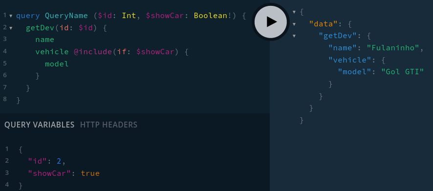<br />
Observe que passamos uma variável do tipo `boolean` como parâmetro em nossa query. Observe também que a mesma é obrigatória, pois estamos utilizando 👉 `!`. <br /> <br />
Isso é necessário pois logo abaixo temos uma <i>condicional</i> que inclui em nossa pesquisa o campo vehicle caso a variável seja `true`.<br /><br />

Também existe uma outra diretiva chamada `@skip` que basicamente é a lógica inversa do `@include`.<br />
Você pode testar utilizando a query abaixo: 

```js
query skipQuery ($id: Int, $skipEmail: Boolean!) {
  getDev(id: $id) {
    name
    email @skip(if: $skipEmail)
  }
}
```

Você pode ver sobre directives com maior profundidade <a href="https://graphql.org/learn/queries/#directives">aqui</a> 

<br />

<h1></h1>

<h2>Mutations</h2>
<h3>O que são mutations ?</h3><br />

De forma simplificada, o type Mutation serve para definir as funções que irão manipular dados. <br />
A funcionalidade é comparável com POST, PUT e DELETE de APIs REST.<br /><br />

<h2>Declarando uma mutation</h2>

Vamos criar uma nova `mutation` que irá adicionar um novo veículo em nossa lista de veículos:

```js
  "./graphql/typedefs.ts"

  type Mutation {
    createVehicle(model: String!, year: Int!): Vehicle!
  }
```

No código acima, declaramos uma nova mutation `createVehicle` que recebe dois parâmetros: `model` e `year`, e retorna um `Vehicle` ( declarado anteriormente em nossa typeDef ) `não nulo` 👉 `!`.

<br />

Agora iremos "resolver" essa mutation:

```js
const resolvers = {

  Query: {
    // ... querys anteriores
  },

  Mutation: { 

    // declarando nossa mutation createVehicle 
    createVehicle(_: any, { model, year }) { // fazendo o destructuring em args

      const id = vehicleList.length;

      vehicleList.push({ id, model, year }); // adiciona o novo veículo na lista
      return vehicleList[id]; // retorna o veículo adicionado
    }
  }
};
```

O exemplo acima é apenas didático. <br />
Uma boa prática seria delegar a responsabilidade de adicionar um novo veículo na lista à outra entidade, que por sua vez teria a responsabiliade de validar as regras de negócio da nossa implementação <br /><br />

Perceba que como definimos o retorno para essa mutation com tipo `Vehicle`, obrigatóriamente devemos retornar o mesmo. Caso isso não seja feito, será lançado o erro: `Cannot return null for non-nullable field Mutation.createVehicle.`

<br />

<h2>Obtendo os dados</h2>

Veja que podemos escolher quais dados queremos que retorne dessa mutation, assim que a mesma for finalizada:
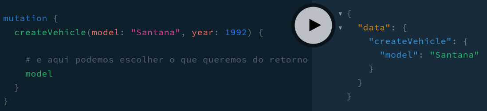<br />

<br />
<h2>Criando mutations com variáveis</h2>

De forma similar as querys, podemos usar variáveis nas nossas mutations:

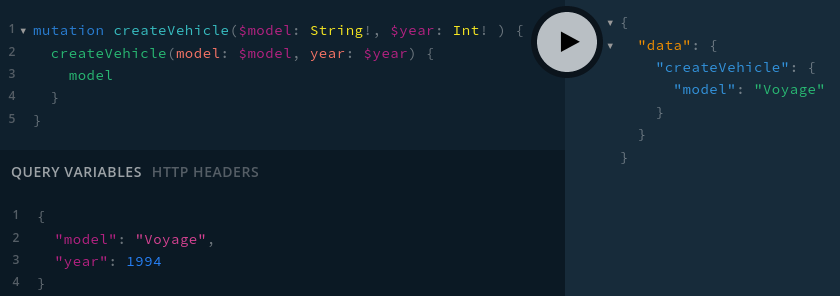<br />

Veja que no exemplo acima também foi passado um `Operation Name` para a mutation, mas o mesmo não é obrigatório para a mesma funcionar. 

<br />
Que tal fazer alguns testes ?<br />
Tente passar um tipo diferente como variável e veja o que acontece !

<br />

<h2>O Type Input</h2>

Podemos agrupar os dados de uma mutation dentro de um tipo especial chamado `input` <br />
Mas qual é o problema que isso resolve ?<br />
Suponha que queremos `atualizar` os nossos veículos:

```js
  "./graphql/typedefs.ts"

  type Mutation {
    createVehicle(model: String!, year: Int!): Vehicle!
    updateVehicle(id: ID!, model: String!, year: Int!): Vehicle! // nova mutation
  }
```

Perceberam que nas duas `mutations` estamos repetindo os campos `model` e `year` ? <br />
Neste caso não é um problema, pois a quantidade de dados são pequenos.<br /> Mas isso pode se tornar um grande problema caso a quantidade de dados aumente. <br /><br />

Então como resolvemos isso ?<br />
Criamos um novo tipo `input`: 

```js
  "./graphql/typedefs.ts"

  input vehicleData {
    model: String!, 
    year: Int!
  }

```

E agora atualizamos o nosso tipo `Mutation` em typeDefs:

```js
  "./graphql/typedefs.ts"

  type Mutation {
    createVehicle(data: vehicleData): Vehicle!
    updateVehicle(id: ID!, data: vehicleData): Vehicle! // precisamos do id para atualizar
  }
```

Desta forma agrupamos todos os dados que precisamos no tipo `input vehicleData` <br />
Mas agora precisamos atualizar nosso resolver:


```js
  // antes
  createVehicle: (_: any, { model, year }) => registerVehicle(model, year)

  // depois
  createVehicle: (_: any, { data }) => registerVehicle(data.model, data.year),
```

Agora recebemos um objeto `data` como argumento em nosso `resolver`<br />
Uma modificação também será nescessária ao escrever nossa `mutation`:
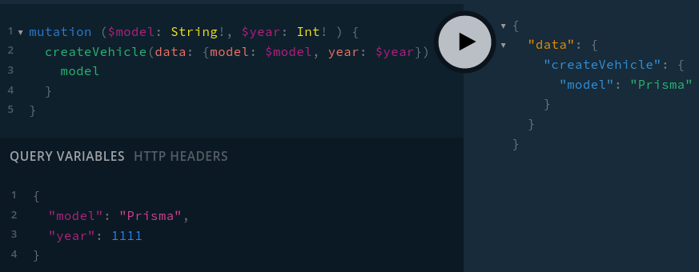<br />
Percebeu ? Estamos passando o `data` com as nossas variáveis.

<br />

<h2>Bônus</h2>
<h3>Tratamento de erros</h3><br />

Vamos adicionar uma condicional na nossa mutation `createVehicle` para não aceitar modelos que já existam em nosso "banco de dados": 

```js 
  "./graphql/resolvers.ts"
  Mutation: {
    createVehicle: (_: any, { model, year }) => registerVehicle(model, year),
  }

  function registerVehicle(model: string, year: number) {

  const checkModel = db.vehicleList.some(vehicle => vehicle.model === model);
  if (checkModel) throw new Error("this model has already been registered");

  const id = db.vehicleList.length;
  db.vehicleList.push({ id, model, year });
  return db.vehicleList[id];
};
``` 

Agora ao tentar adicionar um modelo que já existe em nosso sistema, um erro será lançado:

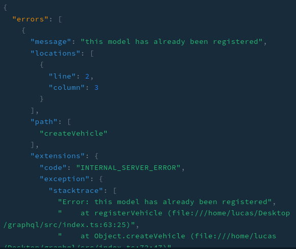<br />

Mas existe uma forma melhor de capturar e tratar esse erro, caso seja nescessário:

```js
const server = new ApolloServer({ 
  typeDefs, 
  resolvers, 
  ...errorHandler, // podemos colocar diretamente aqui também
  plugins: [Playground()]
});
```

<br />

```js 
  "./middlewares/errorHandler.ts"
  const errorHandler = {
    formatError: (err: { message: string; }) => {

      if (err.message.startsWith("this model has already been registered")) {
        return new Error(err.message);
      }
    },
};
```
Dessa forma nós "capturamos" o erro, e podemos trata-lo afim de não expormos dados sensíveis/desnecessários:
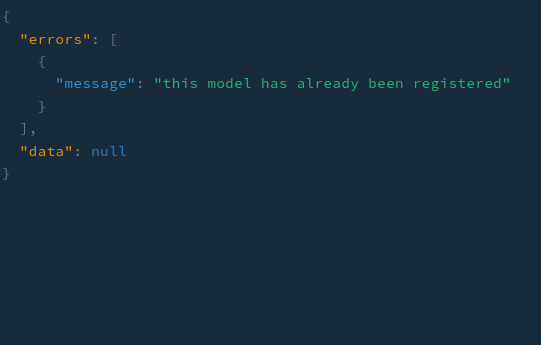<br />

<br />
Bom, com isso espero ter te ajudado a iniciar seus estudos em GraphQL.<br />
Até mais! Atenciosamente, Lucas Oliveira.